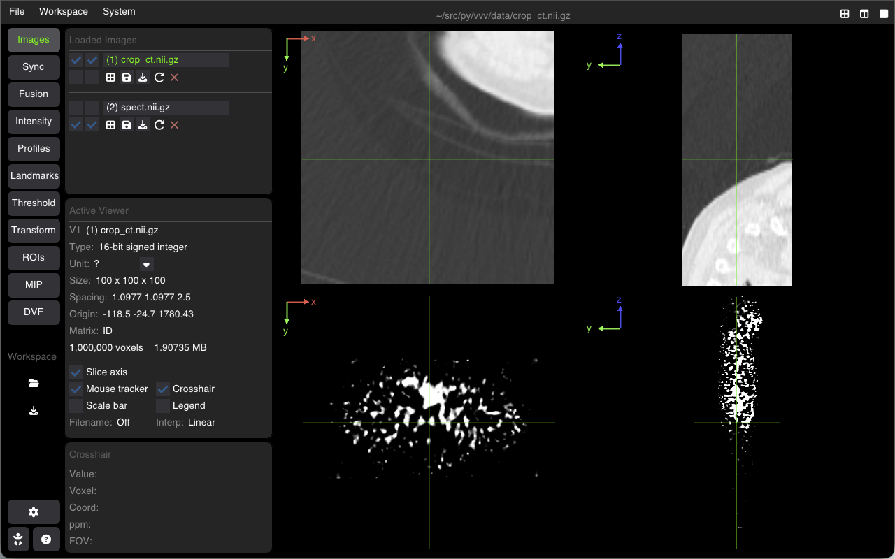
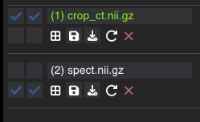
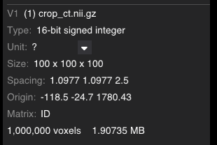

# Working with Images

VVV supports loading, managing, and inspecting multi-dimensional medical and scientific images in physical space.



---

## Supported Formats

VVV relies on SimpleITK and native loaders to read standard medical imaging and scientific volume formats:

| Format | Extensions | Description |
| :--- | :--- | :--- |
| **NIfTI** | `.nii`, `.nii.gz` | Standard neuroimaging & general 3D/4D volumes |
| **MetaImage** | `.mha`, `.mhd` | Medical volumes with detached/attached raw headers |
| **NRRD** | `.nrrd`, `.nhdr` | Nearly Raw Raster Data |
| **DICOM** | Directory or `.dcm` | CT, MR, PET, RT-Dose, RT-Struct series |
| **4D Sequences** | `.nii.gz`, `.mha` | Dynamic/cardiac series, 4D respiratory phases |
| **Displacement Fields (DVF)** | `.nii.gz`, `.mhd` | 3D deformation vector fields (3-component displacement) |
| **Scientific Images** | `.tif`, `.png`, `.jpg` | 2D/3D microscopy or biomedical images |

---

## Loading Images

You can load images through multiple convenient ways:
* **Drag and Drop**: Drag image files or DICOM folders directly onto the VVV window.
* **Top Menu**: Select **File** $\rightarrow$ **Open Image...** (<kbd>Ctrl+O</kbd> / <kbd>Cmd+O</kbd>) or **File** $\rightarrow$ **Open DICOM Folder...**.
* **Command Line**: Launch with filenames as positional arguments:
  ```bash
  vvv data/crop_ct.nii.gz data/spect.nii.gz
  ```

---

## The Images Tab

The **Images** tab on the left sidebar lists all volumes currently loaded in memory:



### 1. Viewport Assignment (V1–V4 Checkboxes)
The $2\times 2$ checkbox grid assigns the image to any of the active viewports:
* **V1** (top-left) &nbsp;|&nbsp; **V2** (top-right)
* **V3** (bottom-left) &nbsp;|&nbsp; **V4** (bottom-right)

Checking a box displays the volume in that viewport. Multiple viewports can display the same image simultaneously with independent zoom, slice position, or orientation.

### 2. Renaming Images
* Click or double-click the filename text field to rename the image display label.
* The new name updates across all viewports and info panels.

### 3. Action Buttons
Each image entry features a row of quick actions:
* ⊞ **Show in all viewers**: Instantly assigns the image to all 4 viewports.
* 💾 **Save**: Quick-saves modifications back to the original file on disk.
* 📥 **Save As**: Saves the image to a new file path and format.
* 🔄 **Reload**: Reloads the volume from disk. If the file was modified externally, an orange indicator flags the image.
* ✕ **Close**: Unloads the volume from memory.

### 4. 4D Time Slider
When a 4D volume or time sequence is loaded, an interactive time slider appears below the volume entry to navigate across temporal frames.

---

## Active Viewer & Image Metadata

When clicking on any viewport, it becomes the **Active Viewer** (highlighted border). The sidebar panels reflect its properties:



### Physical Metadata
* **Type**: Voxel data type (e.g. `int16`, `float32`).
* **Unit**: Physical intensity unit. Click the dropdown arrow <kbd>▾</kbd> to assign presets (`HU`, `SUV`, `Gy`, `Bq/mL`, `counts`, `a.u.`) or type a custom unit.
* **Size**: Voxel grid dimensions $(N_x \times N_y \times N_z)$.
* **Spacing**: Physical voxel spacing $(\Delta x, \Delta y, \Delta z)$ in mm.
* **Origin**: Real-world physical origin $(X_0, Y_0, Z_0)$ in mm.
* **Matrix**: Orientation and direction cosine matrix. Hover over the field to inspect the full $3\times 3$ transformation matrix.
* **Memory**: Approximate RAM footprint of the volume in memory.

### Visibility Overlays
Below the metadata fields, quick checkboxes toggle viewport annotations:
* **Slice axis**: Colored coordinate axes indicating anatomical orientation.
* **Pixels grid**: Voxel boundary grid lines when zoomed in at high magnification.
* **Mouse tracker**: Real-time cursor coordinates and intensity reading.
* **Crosshair**: Interactive intersection crosshair.
* **Scale bar**: Calibrated physical distance bar in mm.
* **Legend**: Colormap intensity calibration bar and unit label.

### Crosshair Readout
The **Crosshair** panel provides real-time point measurements:
* **Value**: Voxel intensity directly under the crosshair.
* **Voxel**: Discrete grid index $(i, j, k)$.
* **Coord**: Physical position $(X, Y, Z)$ in mm.
* **ppm**: Pixels-per-millimeter (current zoom level).
* **FOV**: Current visible field of view in mm $(W \times H)$.

