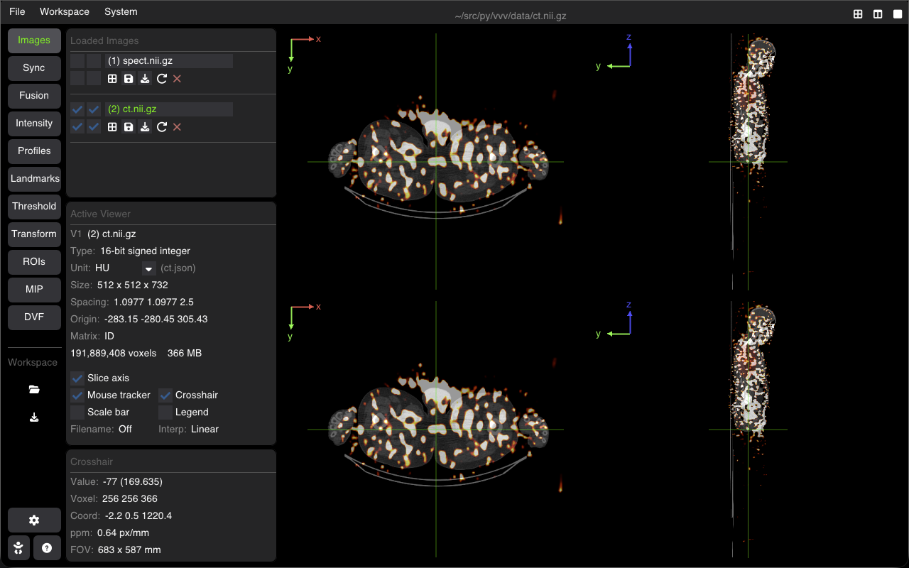

# Command-Line Interface (CLI)

VVV provides a rich command-line interface to launch directly into multi-image layouts, fusion overlays, synchronization groups, label maps, and workspaces.



```bash
vvv data/ct.nii.gz,data/spect.nii.gz,hot,0.6 + data/Sphere_1.nii.gz
```

---

## Basic Usage

Launch with one or more images:

```bash
# Open a single image
vvv patient_ct.nii.gz

# Open multiple images in side-by-side viewports
vvv ct.nii.gz spect.nii.gz dose.nii.gz
```

---

## Overlay & Fusion Syntax

Attach an overlay to a base image using a **comma-separated syntax**:

```
vvv <base>[,<overlay>][,<colormap>][,<opacity>][,<min_threshold>]
```

| Field | Description | Default / Options |
| :--- | :--- | :--- |
| **base** | Base image path | Required |
| **overlay** | Fused overlay image path | Optional |
| **colormap** | Overlay colormap | `Jet`, `Hot`, `Cold`, `Dosimetry`, `Grayscale`, `Segmentation`, `Reg` |
| **opacity** | Blending alpha ($0.0$ to $1.0$) | `0.5` |
| **min_threshold** | Clip overlay below this intensity | None |

### Examples

```bash
# Standard alpha fusion with default Jet colormap (opacity 0.5)
vvv ct.nii.gz,spect.nii.gz

# Fusion with Hot colormap at 70% opacity
vvv ct.nii.gz,spect.nii.gz,hot,0.7

# Clip low background intensities (threshold at 150)
vvv ct.nii.gz,spect.nii.gz,hot,0.6,150

# Checkerboard registration mode (linked W/L, grayscale)
vvv fixed.nii.gz,moving.nii.gz,reg

# Apply a colormap to the base image without an overlay (empty second slot)
vvv spect.nii.gz,,hot
```

---

## Multi-Viewer Synchronization

Link viewports together at launch:

```bash
# Synchronize all images spatially (pan, zoom, slice crosshair)
vvv ct.nii.gz spect.nii.gz --sync      # or -s

# Synchronize Window/Level contrast across all images
vvv mri_t1.nii.gz mri_t2.nii.gz --linkall-wl    # or -lw

# Synchronize both spatial navigation and Window/Level
vvv ct_pre.nii.gz ct_post.nii.gz -s -lw

# Assign specific synchronization groups (group_id:image)
vvv 1:ct.nii.gz 1:spect.nii.gz 2:mr1.nii.gz 2:mr2.nii.gz
```

---

## Label Maps & ROIs

Attach binary or multi-label segmentations to a base volume using `+`:

```bash
# Load label map as colored ROI contours on the CT volume
vvv ct.nii.gz + organs.nii.gz

# Combine fusion overlay and multiple ROI masks
vvv ct.nii.gz,spect.nii.gz,hot,0.6 + tumor.nii.gz + bladder.nii.gz
```

---

## 4D Sequences & Dynamic Series

Stack multiple 3D timeframes into an interactive 4D volume:

```bash
# Explicit 4D sequence tag
vvv 4D phase0.nii.gz phase1.nii.gz phase2.nii.gz phase3.nii.gz

# Shell glob (automatically grouped if volumes share identical dimensions and spacing)
vvv frame_*.nii.gz
```

---

## Workspaces & Saved Sessions

Restore a complete workspace session (`.vvw`) saved from a previous run:

```bash
vvv my_analysis.vvw
```

---

## Command Options Reference

| Flag | Short | Description |
| :--- | :--- | :--- |
| `--sync` | `-s` | Enable spatial synchronization across all images at startup |
| `--linkall-wl` | `-lw` | Enable Window/Level synchronization across all images |
| `--no-history` | `-nh` | Ignore cached camera/contrast history and launch with defaults |
| `--fast-gl` / `--no-fast-gl` | | Toggle hardware OpenGL nearest-neighbor texture filtering |
| `--debug` | | Display live FPS counter and performance graph overlay |
| `--help` | `-h` | Display the built-in CLI help text |

