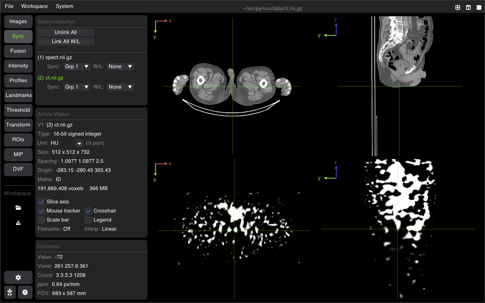
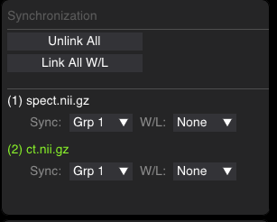

# Multi-Viewer Synchronization

VVV allows multiple images and viewports to synchronize in real time. Synchronization operates in physical space (mm), linking images regardless of differences in image matrix dimensions, voxel resolutions, or orientations.



---

## Synchronization Types

VVV distinguishes two independent synchronization modes:

| Mode | What is Synchronized | Scope |
| :--- | :--- | :--- |
| **Spatial Sync** (`Sync: Grp 1, 2...`) | Crosshair position, slice navigation, zoom scale (ppm), pan position, and 4D timeframes | Physical Space (mm) |
| **Window/Level Sync** (`W/L: Grp A, B...`) | Window width, window level, and colormaps | Radiometric / Contrast |

---

## The Sync Tab

Open the **Sync** tab in the sidebar to manage synchronization groups for all loaded images:



### 1. Global Link Buttons
* **Link All / Unlink All**: Assigns all loaded volumes to Spatial Sync **Grp 1** (or disconnects all).
* **Link All W/L / Unlink All W/L**: Assigns all grayscale volumes to Window/Level Sync **Grp A**.

### 2. Individual Group Selectors
Each loaded image has two independent dropdown selectors:
* **Sync (`Grp 1`, `Grp 2`, `None`)**: Numerical groups for spatial navigation. Images sharing the same number move in unison.
* **W/L (`Grp A`, `Grp B`, `None`)**: Alphabetical groups for contrast. Images sharing the same letter synchronize contrast adjustments and colormap selection.

---

## Keyboard Shortcuts

| Shortcut | Action |
| :--- | :--- |
| <kbd>S</kbd> | **Sync All Viewers**: Instantly syncs all viewports to the current crosshair, slice, and zoom of the active viewer. |
| <kbd>Ctrl+S</kbd> / <kbd>Cmd+S</kbd> | Toggle global spatial synchronization on/off. |

---

## Command-Line Startup Flags

You can enable synchronization directly when launching VVV from the terminal:

```bash
# Link all images spatially at startup
vvv ct.nii.gz spect.nii.gz --sync        # or -s

# Link all images by Window/Level at startup
vvv t1.nii.gz t2.nii.gz --linkall-wl     # or -lw

# Link both spatial navigation and Window/Level
vvv scan1.nii.gz scan2.nii.gz -s -lw

# Assign explicit synchronization groups on launch
vvv 1:ct.nii.gz 1:spect.nii.gz 2:mr1.nii.gz 2:mr2.nii.gz
```

