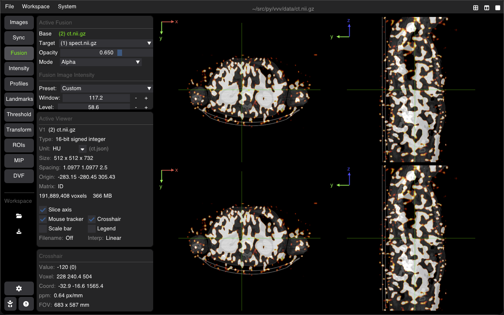
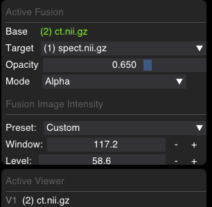

# Image Fusion & Overlays

VVV supports real-time multi-modal image fusion (e.g., PET/CT, SPECT/CT, Dose/CT, MRI/CT). Overlays are dynamically resampled and blended on the GPU in physical space (mm), accommodating differences in matrix resolution, voxel spacing, and patient orientation.



---

## Blending Modes

| Mode | Visual Representation | Use Case |
| :--- | :--- | :--- |
| **Alpha** | Semi-transparent color blend | Standard PET/CT, SPECT/CT, and radiation dose overlays |
| **Registration** | Contrast-matched difference display | Inspecting anatomical alignment between two scans |
| **Checkerboard** | Alternating square tiles of base and overlay | Verifying rigid or deformable registration accuracy |
| **DVF** | Directional displacement vector glyphs | Deformation vector fields and motion analysis |

---

## The Fusion Tab

Select the **Fusion** tab in the sidebar to configure the overlay for the active viewer:



### 1. Active Fusion Setup
* **Base**: Displays the primary image shown in the active viewport.
* **Target (Overlay)**: Dropdown to choose any loaded volume to blend on top of the base image (or `None` to disable).
* **Opacity**: Slider adjusting overlay alpha transparency ($0.0 = \text{invisible}$ to $1.0 = \text{opaque}$).
* **Mode**: Switch between `Alpha`, `Registration`, `Checkerboard`, and `DVF`.
* **Checkerboard Controls** *(visible in Checkerboard mode)*: Adjust square tile size in mm and toggle square inversion (**Swap**).

### 2. Fusion Image Intensity
Controls the radiometric rendering of the **overlay image only**, leaving the base image contrast untouched:
* **Preset**: Colormap and W/L presets (`Custom`, `Optimal`, `Min/Max`).
* **Window / Level**: Adjust contrast width and center level of the overlay.
* **Map**: Choose overlay colormap (`Hot`, `Cold`, `Jet`, `Dosimetry`, `Grayscale`, `Segmentation`).
* **Min Thr (Target)**: Minimum intensity threshold cutoff. Target voxels below this value are rendered fully transparent, removing background noise without altering tissue signal.

---

## Essential Controls & Shortcuts

| Action | Control |
| :--- | :--- |
| **Adjust Base Window/Level** | <kbd>Left Click + Drag</kbd> on image |
| **Auto Base Window/Level** | <kbd>W</kbd> |
| **Auto Overlay Window/Level** | <kbd>X</kbd> |
| **Toggle Overlays / Annotations** | <kbd>H</kbd> |

---

## Launching Fusion via CLI

```bash
# Standard Alpha fusion with Jet colormap at 50% opacity
vvv ct.nii.gz,spect.nii.gz

# Hot colormap at 65% opacity
vvv ct.nii.gz,spect.nii.gz,hot,0.65

# Hot colormap with background noise cutoff below intensity 120
vvv ct.nii.gz,spect.nii.gz,hot,0.65,120

# Registration check mode
vvv fixed_ct.nii.gz,moving_ct.nii.gz,reg
```

