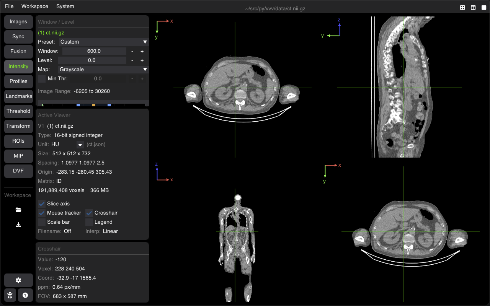
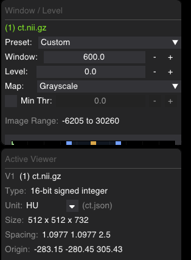

# Window/Level, Colormaps, Physical Units & Histograms

VVV provides precise control over image contrast (Window/Level), color lookup tables, intensity thresholds, real-time histograms, and physical calibrated units.

---

## The Intensity Tab

Select the **Intensity** tab on the sidebar to adjust radiometry for the active base image:

### 1. Contrast Controls
* **Preset**: Quick clinical presets for CT (`CT Abdomen`, `CT Bone`, `CT Lung`, `CT Brain`, `CT Mediastinum`), as well as statistical presets (`Optimal`, `Min/Max`).
* **Window (WW)**: Range of displayed intensity values. Lower values increase contrast across narrow dynamic ranges.
* **Level (WL)**: Midpoint of the displayed window range.
* **Map**: Colormap lookup table (`Grayscale`, `Hot`, `Cold`, `Jet`, `Dosimetry`, `Segmentation`).
* **Min Thr**: Checkbox and slider to set a lower threshold cutoff. Voxels with values below this threshold are rendered completely transparent.
* **Image Range**: Displays true minimum and maximum voxel intensities across the volume.

---

## Interactive Histogram

Below the W/L controls, an interactive real-time histogram plots the voxel intensity distribution:
* **Blue Draggable Lines**: Drag the lower and upper window bounds directly on the plot.
* **Orange Draggable Line**: Drag the window center level ($WL$).
* **Shaded Region**: Highlights the active window width visible on screen.

### Histogram Tools
* **Ctr**: Centers the histogram zoom around the active Window/Level range.
* **Bar**: Toggles bar fill rendering.
* **Lin / Log**: Switches the frequency vertical axis between linear and logarithmic scale.
* **Popout ()**: Opens the histogram in an enlarged standalone window for high-precision inspection.

---

## Physical Units & Presets

VVV tracks physical calibrated units attached to image metadata:

| Unit | Modality | Common Range / Notes |
| :--- | :--- | :--- |
| **HU** | CT | Hounsfield Units (air: $-1000$, water: $0$, bone: $+1000$) |
| **SUV** | PET | Standardized Uptake Value |
| **SUL** | PET | SUV normalized by Lean Body Mass |
| **Gy** | Radiotherapy | Absorbed radiation dose in Gray |
| **Bq/mL**, **kBq/mL** | Nuclear Medicine | Absolute radioactivity concentration |
| **counts** | SPECT / PET | Raw acquisition counts |
| **a.u.** | MRI / Other | Arbitrary / relative units |

> [!TIP]
> You can assign or modify the unit anytime in the **Active Viewer** panel using the dropdown arrow <kbd>▾</kbd> beside the **Unit** field.

---

## Shortcuts Summary

| Action | Shortcut |
| :--- | :--- |
| **Adjust Window/Level** | <kbd>Left Click + Drag</kbd> on image (horizontal: Window, vertical: Level) |
| **Auto Window/Level** | <kbd>W</kbd> |
| **Auto Overlay Window/Level** | <kbd>X</kbd> |
| **Nearest-Neighbor / Linear Interpolation** | <kbd>K</kbd> |
| **Toggle Color Legend Bar** | <kbd>L</kbd> |

