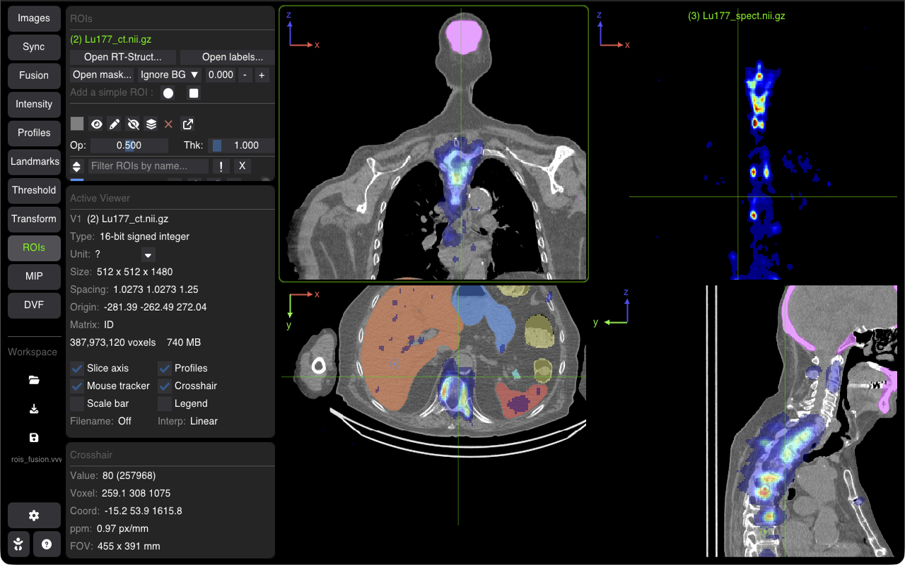

# Regions of Interest (ROIs) & Contours

VVV supports simultaneous display of multiple segmentation masks, organ contours, and radiation therapy structure sets (RT-Struct).



---

## Loading ROIs

You can load segmentation volumes and ROIs in several ways:
* **Drag and Drop**: Drop 3D binary or multilabel labelmaps (`.nii`, `.nii.gz`, `.mhd`, `.nrrd`) directly onto any viewer.
* **Images Tab**: In the **Images** panel, select an image and assign it as an ROI mask.
* **CLI**: Launch with multiple `-r` or `--roi` flags:
  ```bash
  vvv data/ct.nii.gz -r data/liver.nii.gz -r data/tumor.nii.gz
  ```

---

## The ROI Tab Panel

Switch to the **ROI** tab on the sidebar to manage loaded structures:

### 1. Structure List & Controls
* **Visibility (Eye Icon)**: Toggle display of individual ROIs on/off.
* **Color Swatch**: Click to customize the display color for each structure.
* **Contour Width**: Adjust line thickness for contour outlines.
* **Opacity**: Slider controlling the transparency of the filled mask overlay.
* **Display Mode**:
  * **Contour**: Renders smooth isoline boundaries around the region.
  * **Raster**: Fills the entire segmented volume as a semi-transparent color mask.
  * **Both**: Draws both the filled raster region and the highlighted boundary contour.

### 2. ROI Volume Statistics
Selecting an ROI displays anatomical and quantitative statistics:
* **Voxel Count**: Total number of positive voxels.
* **Physical Volume**: Calculated volume in $\text{cm}^3$ (or $\text{mL}$).
* **Intensity Statistics**: Mean, Min, Max, and Standard Deviation of the underlying base image intensities within the mask.

---

## Shortcuts Summary

| Action | Shortcut |
| :--- | :--- |
| **Toggle All ROIs Visibility** | <kbd>Alt + R</kbd> |
| **Cycle Contour / Raster / Both Mode** | <kbd>M</kbd> |
| **Increase / Decrease Contour Width** | <kbd>[</kbd> / <kbd>]</kbd> |
| **Toggle Crosshair** | <kbd>C</kbd> |

