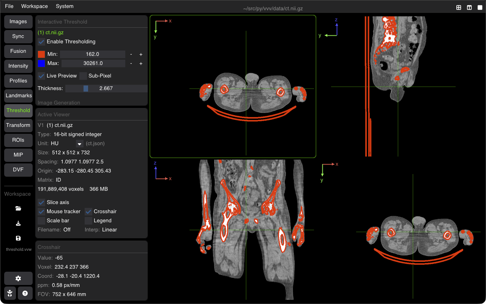

# Interactive Thresholding & Binary Masks

VVV includes an interactive thresholding tool to segment tissues, bone structures, air cavities, or high-uptake regions with real-time visual contour feedback.

---

## Setting Up Thresholds

Open the **Threshold** tab on the sidebar to configure segmentation ranges:

### 1. Range Sliders
* **Min Threshold**: Lower bound cutoff. Voxels below this value are excluded.
* **Max Threshold**: Upper bound cutoff. Voxels above this value are excluded.
* **Preset Buttons**: Quick access to common anatomical thresholds (e.g., Bone $> 250\text{ HU}$, Soft Tissue $[-100, 200]\text{ HU}$, Air $< -600\text{ HU}$).

### 2. Live Visualization Options
* **Live Contour Preview**: Displays real-time vector contours around voxels within the current $[Min, Max]$ interval as you drag the sliders.
* **Contour Color & Width**: Customize the outline color and thickness.
* **Sub-pixel Contouring**: Interpolates voxel boundaries for smooth, continuous curves across slice planes.

---

## Creating & Exporting Masks

Once you have tuned the threshold boundaries:
* **Create ROI**: Converts the thresholded volume into an active ROI layer. It appears immediately in the **ROI** tab for quantitative volume calculation and multi-structure overlay.
* **Save Binary Image**: Exports the segmented region as a 3D binary volume (`.nii.gz`, `.mhd`) to disk.

---

## Shortcuts Summary

| Action | Shortcut |
| :--- | :--- |
| **Toggle Threshold Overlay** | <kbd>T</kbd> |
| **Reset Threshold Bounds** | <kbd>R</kbd> (when slider active) |
| **Synchronize Threshold Across Viewers** | Enabled automatically in linked viewers |

