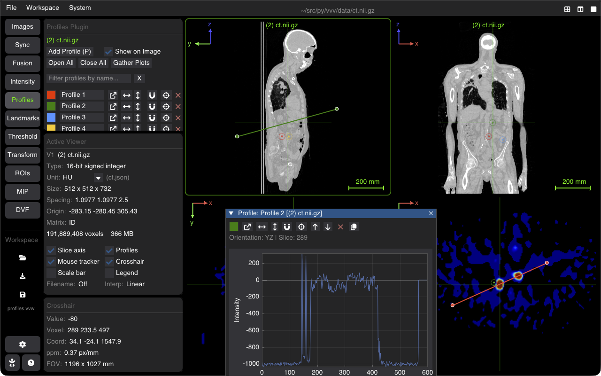

# 1D Line Profiles & Measurements

The Profile tool extracts and plots 1D voxel intensity profiles along arbitrary lines in 2D and 3D space, useful for spatial resolution assessment, edge sharpness, dosimetry verification, and distance measurements.

---

## Drawing & Adjusting Profiles

1. Switch to the **Profile** tab in the sidebar.
2. Click **Add Profile** or use the drawing shortcut.
3. Click and drag in any slice viewer to define the line segment from Start $(x_1, y_1, z_1)$ to End $(x_2, y_2, z_2)$.
4. Interactive handles allow dragging either endpoint or translating the entire line segment.

---

## Profile Plot Panel

The panel plots voxel intensity vs. physical distance along the line:
* **Distance Axis**: Physical length in millimeters ($\text{mm}$) along the segment.
* **Intensity Axis**: True calibrated pixel value ($\text{HU}$, $\text{SUV}$, $\text{Gy}$, or arbitrary).
* **Multi-Image Profiles**: When fusion overlays or multiple images are loaded, all overlapping modalities are plotted simultaneously with corresponding line colors.
* **Sampling Resolution**: Line profile samples can be computed using nearest-neighbor or trilinear interpolation.

---

## Measurements & Data Export

* **Euclidean Distance**: Displays exact 3D physical distance between the start and end points.
* **FWHM / Edge Analysis**: Measure Full Width at Half Maximum or peak-to-peak distances directly from the interactive plot.
* **Export CSV**: Save the interpolated $(x, y, z, \text{distance}, \text{intensity})$ data points to a `.csv` file for external analysis in Python, MATLAB, or Excel.

---

## Shortcuts Summary

| Action | Shortcut |
| :--- | :--- |
| **Add / Draw Profile** | <kbd>P</kbd> |
| **Clear Active Profile** | <kbd>Escape</kbd> |
| **Move Line Handle** | <kbd>Left Click + Drag</kbd> on endpoint handle |
| **Pan / Zoom Plot** | <kbd>Right Click + Drag</kbd> or <kbd>Scroll</kbd> inside plot widget |

