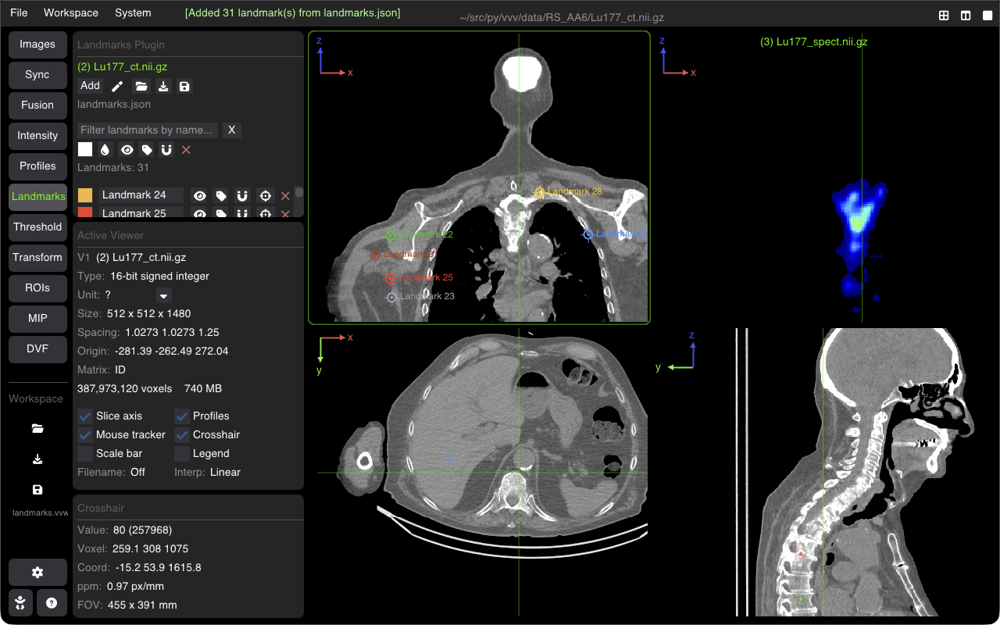

# 3D Point Landmarks & Navigation

VVV enables placing, labeling, measuring, and navigating anatomical and fiducial 3D point landmarks across multi-modality volumes.

---

## Placing & Managing Landmarks

Open the **Landmark** tab on the sidebar:

### 1. Adding Points
* Click **Add Landmark** or hold <kbd>Shift + Left Click</kbd> at any point in any 2D viewer slice.
* A 3D marker is registered at the exact physical coordinates $(X, Y, Z)$ in millimeters.
* Markers are projected onto all active viewers, rendering crosshairs and numeric identifiers.

### 2. Point Table & Navigation
* **Jump to Landmark**: Click on any row in the landmarks table to instantly center all synchronized slice viewers on that 3D coordinate.
* **Rename & Label**: Assign descriptive anatomical names (e.g., `Bifurcation`, `Apex`, `Tumor Center`).
* **Color Coding**: Customize marker colors individually or by group.
* **Delete / Clear**: Remove individual points or reset the list.

---

## 3D Distance Measurements & Export

* **Point-to-Point Distances**: Select two landmarks to calculate their 3D Euclidean distance:
  $$d = \sqrt{(x_2 - x_1)^2 + (y_2 - y_1)^2 + (z_2 - z_1)^2}$$
* **Import / Export**:
  * **Export CSV / JSON**: Save landmark positions and labels for registration evaluation (TRE - Target Registration Error) or anatomical reporting.
  * **Load Landmarks**: Read external landmark files formatted in CSV or ITK/Slicer fiducial formats.

---

## Shortcuts Summary

| Action | Shortcut |
| :--- | :--- |
| **Add Landmark at Cursor** | <kbd>Shift + Left Click</kbd> |
| **Jump to Next Landmark** | <kbd>N</kbd> |
| **Jump to Previous Landmark** | <kbd>Shift + N</kbd> |
| **Delete Selected Landmark** | <kbd>Delete</kbd> / <kbd>Backspace</kbd> |

