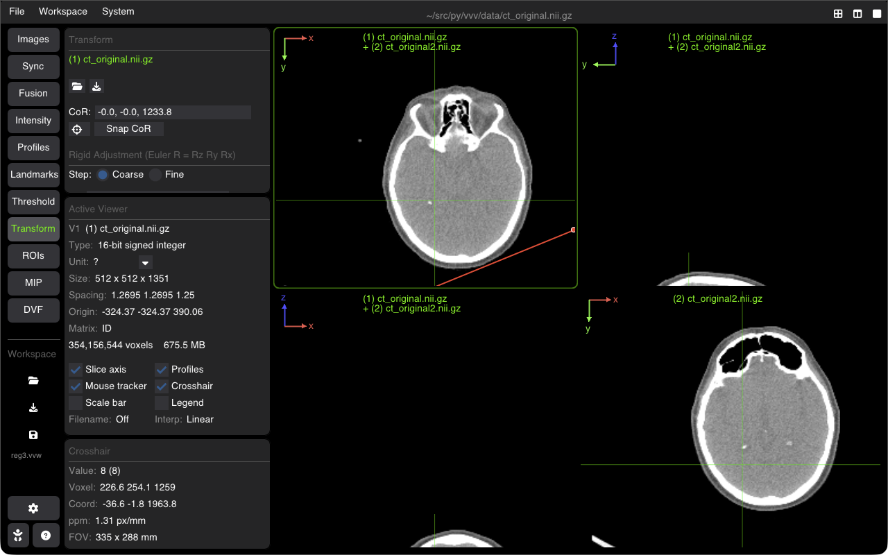

# Manual Rigid Image Registration

The Registration tool provides interactive manual rigid alignment (6 Degrees of Freedom: 3 translations, 3 rotations) between a fixed reference image and a moving floating image.

---

## Aligning Images

1. Load both the fixed reference volume and the moving volume into VVV.
2. Open the **Registration** tab on the sidebar.
3. Select the **Fixed Image** and the **Moving Image** from the dropdown selectors.

---

## 6-DOF Transformation Controls

Use the interactive sliders or numeric step inputs to adjust the rigid transformation in real time:

### Translation ($\text{mm}$)
* **$T_x$**: Left / Right translation.
* **$T_y$**: Posterior / Anterior translation.
* **$T_z$**: Inferior / Superior translation.

### Rotation ($\text{degrees}$)
* **$R_x$ (Pitch)**: Rotation around the lateral axis.
* **$R_y$ (Roll)**: Rotation around the anteroposterior axis.
* **$R_z$ (Yaw)**: Rotation around the craniocaudal axis.
* **Center of Rotation**: Center around the image physical center or the current 3D crosshair position.

---

## Visual Verification Tools

To inspect the quality of the spatial alignment:
* **Checkerboard**: Interleaves alternating tiles of the fixed and moving images. Discontinuities in edges highlight misalignments.
* **Difference Image**: Subtracts normalized intensities to highlight residual differences.
* **Color Overlay**: Renders the fixed image in Green and the moving image in Magenta (or Red/Cyan) to evaluate anatomical overlap.
* **Flicker**: Quickly toggles visibility between fixed and moving images.

---

## Saving Transformations

* **Save Transform**: Export the $4 \times 4$ rigid transformation matrix as an ITK/SimpleITK affine matrix (`.tfm`, `.txt`, `.mat`).
* **Resample & Save**: Apply the transformation directly and save the resampled moving volume onto the fixed image geometry grid.

---

## Shortcuts Summary

| Action | Shortcut |
| :--- | :--- |
| **Reset Transformation** | Click **Reset Transform** |
| **Step Step Translations ($1\text{ mm}$)** | Arrow keys (when slider focused) |
| **Toggle Checkerboard** | Accessible via Fusion overlay modes |

