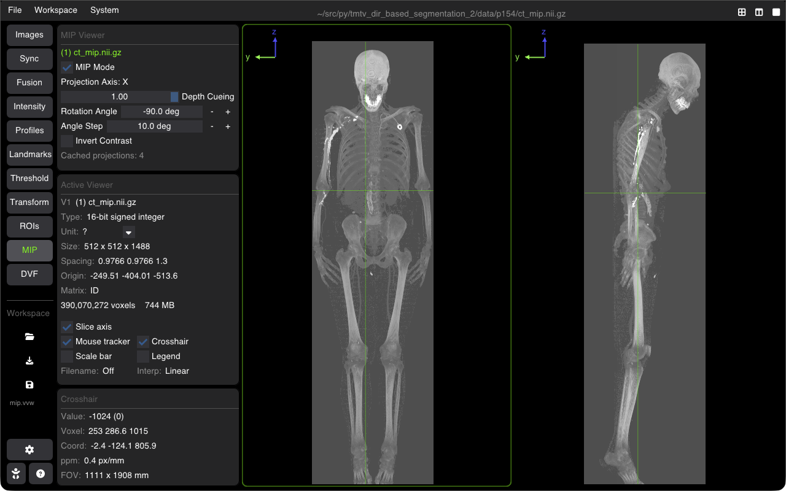

# Maximum Intensity Projection (MIP)

Maximum Intensity Projection (MIP) projects voxels with the highest intensity values along rays through a 3D volume or slab onto a 2D projection plane. It is widely used in nuclear medicine (PET/SPECT) for detecting hot spots and in CT/MR angiography for visualizing vascular structures.

---

## Configuring MIP

Open the **MIP** tab in the sidebar:

### 1. Projection Modes
* **Full Volume MIP**: Casts projection rays through the entire 3D extent of the image.
* **Slab MIP (Thick Slice)**: Projects only across a user-defined slab thickness centered at the current slice coordinate.
* **Minimum Intensity Projection (MinIP)**: Projects minimum intensity values (useful for air pathways, lungs, and low-attenuation structures).
* **Average Intensity Projection (AIP)**: Averages voxel values along the ray path (useful for 4D-CT motion assessment).

### 2. Slab Controls
* **Slab Thickness**: Set the physical slab depth in millimeters ($\text{mm}$).
* **Projection Angle**: Rotate the projection ray angle dynamically to view the dataset from arbitrary perspectives.
* **Continuous Rotation**: Play an automated rotational cine loop around the longitudinal axis.

---

## Modality Use Cases

| Modality | Mode | Typical Usage |
| :--- | :--- | :--- |
| **PET / SPECT** | Full Volume MIP | Whole-body tracer biodistribution, lesion staging, hot-spot detection |
| **CT Angiography** | Thin Slab MIP ($5\text{--}15\text{ mm}$) | Vessel continuity, stenosis evaluation, aneurysm detection |
| **Chest CT** | MinIP | Air trapping, bronchiolitis, emphysema assessment |
| **4D CT** | AIP (Average) | Internal Target Volume (ITV) contouring in radiation oncology |

---

## Shortcuts Summary

| Action | Shortcut |
| :--- | :--- |
| **Toggle MIP Mode** | Accessible via MIP panel checkbox |
| **Adjust Slab Thickness** | Slider in MIP tab or <kbd>Shift + Scroll</kbd> (when configured) |
| **Cycle Slice / Slab Center** | <kbd>Scroll</kbd> or <kbd>Page Up</kbd> / <kbd>Page Down</kbd> |

