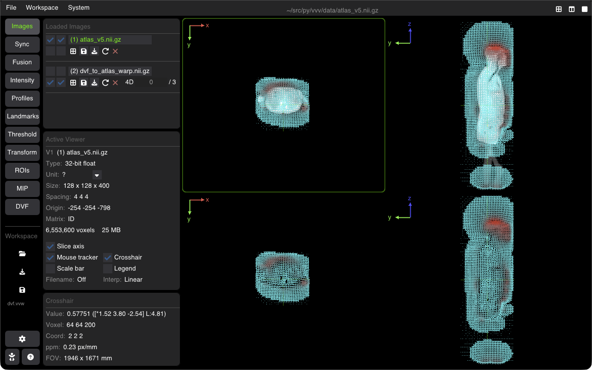

# Displacement Vector Fields (DVF)

VVV visualizes 3D Displacement Vector Fields (DVF) generated by deformable image registration (DIR) algorithms, respiratory motion models, or biomechanical finite-element simulations.



---

## Loading & Displaying DVFs

DVFs are loaded as 3D vector images ($3 \times \text{components}$ per voxel representing $\Delta x, \Delta y, \Delta z$ displacements):
* **File Formats**: Supports ITK vector images (`.mhd`, `.nii.gz`, `.nrrd`).
* **CLI Loading**: Load directly with `--dvf` or by dropping onto the active viewer:
  ```bash
  vvv data/ct.nii.gz --dvf data/motion_dvf.mhd
  ```

---

## Display Modes

Switch to the **DVF** tab to customize vector rendering:

### 1. Vector Quiver / Arrows
* Renders directional 2D/3D glyph arrows showing direction and magnitude of motion.
* **Subsampling (Step)**: Downsamples the arrow grid (e.g., show arrow every 4th or 8th voxel) to prevent visual clutter.
* **Scale Factor**: Multiplies arrow lengths to emphasize subtle deformations.
* **Color by Magnitude**: Colors arrows according to the Euclidean displacement norm:
  $$\|\vec{u}\| = \sqrt{u_x^2 + u_y^2 + u_z^2}$$

### 2. Deformed Grid
* Overlays a regular Cartesian coordinate grid warped by the displacement field.
* Grid line compression indicates local contraction; expansion indicates dilation; curvature reveals shearing.

### 3. Magnitude Heatmap
* Renders the scalar displacement norm as a semi-transparent colored overlay directly on top of the anatomical base image.

---

## Quantitative Metrics

* **Max Displacement**: Peak vector magnitude across the slice and entire volume.
* **Mean / Median Displacement**: Average deformation across tissue structures or ROIs.
* **Jacobian Determinant**: Displays areas of volumetric expansion ($J > 1$), contraction ($J < 1$), and non-invertible singularities ($J \le 0$).

---

## Shortcuts Summary

| Action | Shortcut |
| :--- | :--- |
| **Toggle DVF Display** | Toggle checkbox in DVF tab |
| **Increase / Decrease Arrow Density** | Step slider in DVF panel |
| **Scale Arrow Length** | Scale slider in DVF panel |

