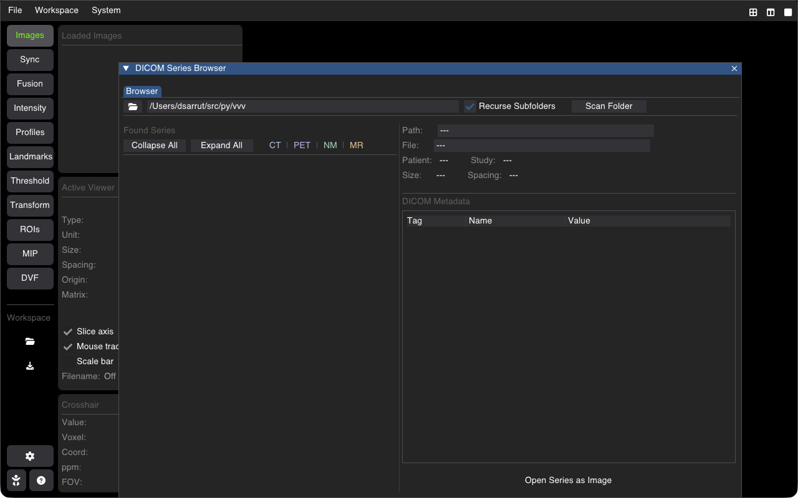

# DICOM Browser & Series Loading

VVV provides a built-in DICOM Browser capable of recursively scanning directories containing mixed DICOM files, sorting slices into consistent volumetric series, and inspecting clinical metadata.



---

## Opening the DICOM Browser

* **From GUI**: Click **Open DICOM Folder** or open the **DICOM** plugin from the interface.
* **From CLI**: Run with the directory path containing DICOM files:
  ```bash
  vvv /path/to/dicom_study/
  ```

---

## Scanning & Hierarchy

The DICOM browser recursively parses all files and groups them according to the DICOM information model:
1. **Patient**: Patient Name, ID, Sex, Date of Birth.
2. **Study**: Study Date, Study Description, Accession Number.
3. **Series**: Series Number, Series Description, Modality (`CT`, `MR`, `PT`, `RTSTRUCT`, `RTDOSE`), Number of Slices, Matrix Dimensions.

---

## Loading Series & Structures

* **Double Click Series**: Loads the selected volume series directly into the primary active slice viewer.
* **Multi-Series Selection**: Load multiple series simultaneously into separate viewers (e.g., CT in viewer 1, PET in viewer 2).
* **RT-STRUCT Loading**: Radiation therapy structure sets (`RTSTRUCT`) automatically extract polygon contours and convert them into VVV ROI layers with their DICOM colors and structure names preserved.
* **RT-DOSE Loading**: Calibrated radiation dose cubes (`RTDOSE`) are automatically scaled with their dose grid scaling factors into absorbed dose in Gray ($\text{Gy}$).

---

## Metadata Inspector

Selecting any series displays comprehensive DICOM tags in the metadata table:
* **Patient & Acquisition Tags**: `PatientID`, `StudyDate`, `SliceThickness`, `PixelSpacing`, `KVP`, `XRayTubeCurrent`.
* **Geometry & Orientation**: `ImagePositionPatient`, `ImageOrientationPatient`, `FrameOfReferenceUID`.
* **Search / Filter**: Rapidly filter tags by name or group/element hex code (e.g., `(0028,0030)`).

---

## Shortcuts Summary

| Action | Shortcut |
| :--- | :--- |
| **Open DICOM Browser** | Accessible via Menu / Toolbar |
| **Close Browser Window** | <kbd>Escape</kbd> |
| **Load Selected Series** | <kbd>Double Click</kbd> or click **Load Series** |

