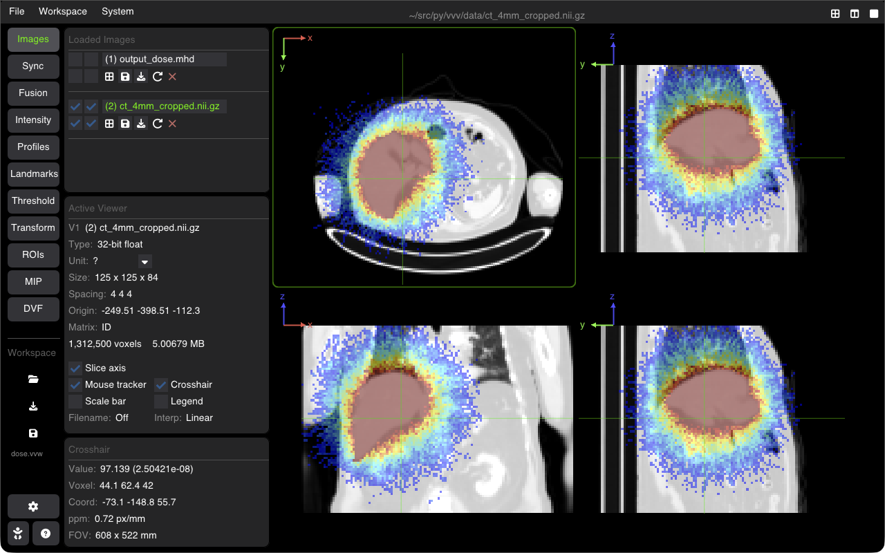

# Workspaces, Export & Screenshots

VVV allows saving and restoring complete multi-viewer visualization sessions using lightweight Workspace files (`.vvw`), as well as high-resolution image exports and automated screenshots.



---

## VVV Workspaces (`.vvw`)

A workspace file stores the entire state of your session in a clean, human-readable JSON format:
* **Loaded Datasets**: Base image paths, overlays, and ROI masks.
* **Viewer Configurations**: Multi-viewer layout (1, 2, 3, or 4 panels), assigned images, slice orientations (Axial, Coronal, Sagittal), zoom, and pan.
* **Synchronization Links**: Active synchronized viewer groups.
* **Radiometry & Visualization**: Window/Level settings, colormaps, opacity, and threshold bounds.
* **Analysis States**: Active landmarks, line profiles, and registration transforms.

### Saving & Loading
* **Save Workspace**: In the **Images** or **File** menu, click **Save Workspace** (or press <kbd>Ctrl + S</kbd> / <kbd>Cmd + S</kbd>).
* **Load Workspace**: Open a `.vvw` file from the GUI or launch directly from the terminal:
  ```bash
  vvv data/dose.vvw
  ```

---

## Exporting High-Resolution Screenshots

VVV provides flexible tools for exporting clean, publication-ready figures:

### 1. Interactive Screenshot
* Click the **Screenshot** icon or press <kbd>F12</kbd> (or <kbd>P</kbd> depending on configuration).
* Options include:
  * **Capture Entire Window**: Captures all viewers, sidebars, and controls.
  * **Capture Viewer Only**: Extracts only the slice viewport without UI borders or menus.
  * **Include / Exclude Overlays**: Toggle crosshairs, anatomical orientation letters (A/P/L/R/S/I), physical scale bars, and color legends.

### 2. Automated Headless Screenshots via CLI
You can generate batch figures directly from scripts or CI pipelines without displaying an interactive window:
```bash
vvv --screenshot my_session.vvw --output figure1.png
```

---

## Shortcuts Summary

| Action | Shortcut |
| :--- | :--- |
| **Save Workspace** | <kbd>Ctrl + S</kbd> / <kbd>Cmd + S</kbd> |
| **Capture Screenshot** | <kbd>F12</kbd> |
| **Toggle Fullscreen Viewport** | <kbd>F11</kbd> |
| **Reset View / Zoom** | <kbd>Space</kbd> |

